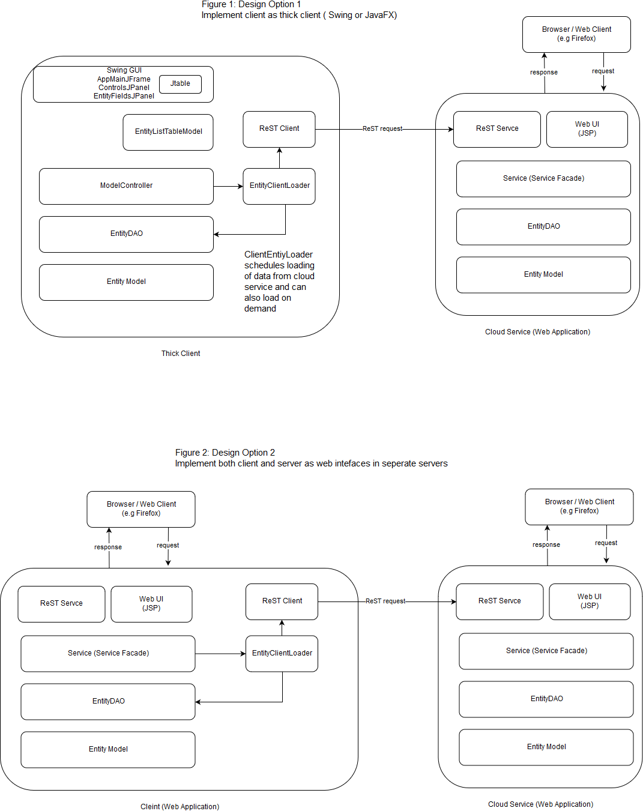

# Early Example generaic Web App 
NOTE This example is originally cloned from 
[COM504 Object Orientated design Week 11 Swing Gui Archetype](https://github.com/gallenc/solent2Public/tree/master/week11)

Following from last week, the example project and maven archetype have now been extended to also generate a swing client similar to what you will need in your project.


Both of these projects can be found here:

[week11/example_project_v1_1](../week11/example_project_v1_1)

## options for project design

You have the option of using a thick client or a web client to impliment your parking system.

You can choose to use Swing or if you wish javaFX to create a thick client. 
This is illustrated in Figure 1.

However if you really arent confident with this, you also have the option to create a second web app which acts as a client in a seperate web container. (Running on a different port). This is illustrated in Figure 2.



The key to both of these designs is a scheduling class which updates the local DAO from the ReST api on a regular basis. This is very similar to the design discussed in the Smart Meter case study we looked at in week9 . 

An example of this scheduling class is in the class [EntityClientLoader.java](../week11/example_project_v1_1/exampleproject/swing-client/src/main/java/solent/ac/uk/ood/examples/swingcient/EntityClientLoader.java) 

This class runs in the client and schedules loading of the model from the cloud service. It can also load the model on demand. The model is saved locally using a local EntityDAO.

## Swing thick client design

Two other aspects of the swing client are worth understanding

Firstly, the Jtable is populated using a datamodel in the class [EntityClientLoader.java](../week11/example_project_v1_1/exampleproject/swing-client/src/main/java/solent/ac/uk/ood/examples/swingcient/EntityListTableModel.java) 

This extends javax.swing.table.AbstractTableModel and maps a list of entities into the data model of the Jtable.

Secondly, notice how the buttons in [ControlsJPanel.java](../week11/example_project_v1_1/exampleproject/swing-client/src/main/java/solent/ac/uk/ood/examples/swingcient/gui/ControlsJPanel.java)

are used to call call long running comands in the ModelController.

In the excerpt below we can see that the findMatchingButton uses a [SwingWorker](https://docs.oracle.com/javase/6/docs/api/javax/swing/SwingWorker.html) to launch the query in a separate thread so that the GUI is not delayed while the action is performed. (This is very similar to Android Intents which you will cover in Mobile Application Development).  

```
 private void findMatchingButtonActionPerformed(java.awt.event.ActionEvent evt) {//GEN-FIRST:event_findMatchingButtonActionPerformed
        // TODO add your handling code here:
        // see https://docs.oracle.com/javase/6/docs/api/javax/swing/SwingWorker.html
        LOG.debug("findMatchingButton selected ");
        Entity templateEntity = entityFieldsJPanel1.getModelEntity();
        jTable1.clearSelection();
        // running query in seperate thread 
        SwingWorker worker = new SwingWorker<String, Void>() {
            @Override
            public String doInBackground() {
                // now redisplay data
                m_modelController.findMatchingSearch(templateEntity);
                return null;
            }

            @Override
            public void done() {
            }
        };
        worker.execute();
}
```


